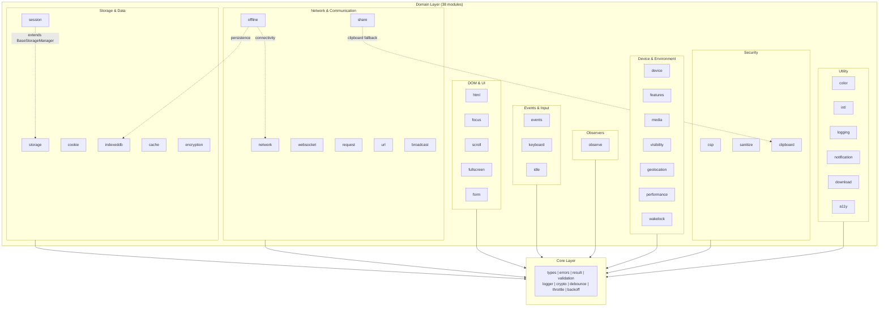

# Architecture

This document describes the module structure and dependency rules for
`@zappzarapp/browser-utils`.

The machine-checked source of truth for these rules is the
`eslint-plugin-boundaries` configuration in `eslint.config.js` — every
dependency edge described here is enforced by `pnpm run lint`. When the rules
change, update this document alongside the config.

## Table of Contents

- [Layer Overview](#layer-overview)
- [Dependency Graph](#dependency-graph)
- [Import Rules](#import-rules)
- [Cross-Module Exceptions](#cross-module-exceptions)
- [Module Categories](#module-categories)
- [Zero Circular Dependencies](#zero-circular-dependencies)
- [Module Count Summary](#module-count-summary)

---

## Layer Overview

The codebase follows a two-layer architecture. There is no aggregating entry
point: the package is **subpath-exports only** (one entry per module in
`package.json`), so consumers import exactly the modules they use and
tree-shaking works at the package level.

```text
        @zappzarapp/browser-utils/<module>  (subpath exports)
                            |
                            v
+----------------------------------------------------------+
|                      Domain Layer                         |
|        (38 independent modules with focused concerns)     |
|   storage, request, form, websocket, share, wakelock, ... |
+----------------------------------------------------------+
                            |
                            v
+----------------------------------------------------------+
|                       Core Layer                          |
|                (Foundation utilities)                     |
|  types | errors | result | validation | logger | crypto   |
|            debounce | throttle | backoff                  |
+----------------------------------------------------------+
```

### Layer Responsibilities

| Layer  | Purpose                                    | Imports From                 |
| ------ | ------------------------------------------ | ---------------------------- |
| Domain | Feature implementations                    | Core, itself (+3 exceptions) |
| Core   | Types, errors, Result, validation, helpers | Only itself (leaf)           |

---

## Dependency Graph

Every domain module depends on core; a group edge below stands for all of its
members. The three module-to-module exceptions are drawn explicitly.



---

## Import Rules

### Core Layer

```typescript
// ALLOWED: Core modules only import from core itself
import type { CleanupFn } from './types.js';

// NOT ALLOWED: Never import from domain modules
// import { Logger } from '../logging/index.js';  // FORBIDDEN
```

### Domain Layer

```typescript
// ALLOWED: Import from core
import { Result, ValidationError, Validator } from '../core/index.js';

// ALLOWED: Import from the same module (internal)
import { StorageConfig } from './StorageConfig.js';

// NOT ALLOWED: Cross-domain imports (except the three documented ones)
// import { Logger } from '../logging/index.js';   // FORBIDDEN
// import { debounce } from '../events/index.js';  // FORBIDDEN (use core)
```

### Import Summary

| From / To | Core | Domain                            |
| --------- | ---- | --------------------------------- |
| Core      | Yes  | No                                |
| Domain    | Yes  | Only itself (+3 excl. exceptions) |

---

## Cross-Module Exceptions

Three module-to-module dependencies are deliberately allowed. Each is a
documented policy in `eslint.config.js`; anything else is a lint error.

| From    | To                 | Why                                                                                         |
| ------- | ------------------ | ------------------------------------------------------------------------------------------- |
| session | storage            | `SessionStorageManager` extends `BaseStorageManager`; both back different Web Storage areas |
| offline | indexeddb, network | Integration module: persists the queue in IndexedDB and reacts to connectivity changes      |
| share   | clipboard          | The Web Share clipboard fallback reuses `ClipboardManager.writeText` (validation included)  |

Adding a new exception requires a new policy in `eslint.config.js` plus a row in
this table — prefer extracting shared code to core or dependency injection (see
[Resolution Pattern](#resolution-pattern)) first.

---

## Module Categories

The grouping mirrors the module tables in the README.

### Core Layer (9 submodules)

Foundation utilities that all domain modules may depend on.

| Submodule  | Path                   | Purpose                                 |
| ---------- | ---------------------- | --------------------------------------- |
| types      | `src/core/types.ts`    | Shared type definitions (CleanupFn)     |
| errors     | `src/core/errors/`     | Error class hierarchy                   |
| result     | `src/core/result/`     | Result<T,E> for explicit error handling |
| validation | `src/core/validation/` | Input validation utilities              |
| logger     | `src/core/logger.ts`   | LoggerLike interface, noopLogger        |
| crypto     | `src/core/crypto.ts`   | Cryptographic randomness helpers        |
| debounce   | `src/core/Debounce.ts` | Debounce utility (pure function)        |
| throttle   | `src/core/Throttle.ts` | Throttle utility (pure function)        |
| backoff    | `src/core/Backoff.ts`  | Backoff delay computation (retry logic) |

### Storage & Data (6 modules)

| Module     | Path              | Purpose                            | Dependencies  |
| ---------- | ----------------- | ---------------------------------- | ------------- |
| storage    | `src/storage/`    | localStorage with LRU eviction     | core          |
| session    | `src/session/`    | sessionStorage management          | core, storage |
| cookie     | `src/cookie/`     | Cookie management, secure defaults | core          |
| indexeddb  | `src/indexeddb/`  | IndexedDB wrapper for large data   | core          |
| cache      | `src/cache/`      | HTTP cache, stale-while-revalidate | core          |
| encryption | `src/encryption/` | AES-GCM encrypted storage (PBKDF2) | core          |

### Network & Communication (7 modules)

| Module    | Path             | Purpose                                            | Dependencies             |
| --------- | ---------------- | -------------------------------------------------- | ------------------------ |
| network   | `src/network/`   | Network status, retry queue                        | core                     |
| offline   | `src/offline/`   | Offline queue for data sync                        | core, indexeddb, network |
| websocket | `src/websocket/` | WebSocket with auto-reconnect                      | core                     |
| request   | `src/request/`   | Fetch interceptor: middleware, auth, retry, dedupe | core                     |
| url       | `src/url/`       | URL builder, query params, history                 | core                     |
| broadcast | `src/broadcast/` | BroadcastChannel cross-tab messaging               | core                     |
| share     | `src/share/`     | Web Share API with clipboard fallback              | core, clipboard          |

### DOM & UI (5 modules)

| Module     | Path              | Purpose                        | Dependencies |
| ---------- | ----------------- | ------------------------------ | ------------ |
| html       | `src/html/`       | HTML escaping, DOM helpers     | core         |
| focus      | `src/focus/`      | Focus trap, focusable elements | core         |
| scroll     | `src/scroll/`     | Scroll utilities and locking   | core         |
| fullscreen | `src/fullscreen/` | Fullscreen API wrapper         | core         |
| form       | `src/form/`       | Form serialization, validation | core         |

### Events & Input (3 modules)

| Module   | Path            | Purpose                                                   | Dependencies |
| -------- | --------------- | --------------------------------------------------------- | ------------ |
| events   | `src/events/`   | Event delegation (re-exports debounce/throttle from core) | core         |
| keyboard | `src/keyboard/` | Keyboard shortcut manager                                 | core         |
| idle     | `src/idle/`     | requestIdleCallback utilities                             | core         |

### Observers (1 module)

| Module  | Path           | Purpose                                | Dependencies |
| ------- | -------------- | -------------------------------------- | ------------ |
| observe | `src/observe/` | Intersection/Resize/Mutation observers | core         |

### Device & Environment (7 modules)

| Module      | Path               | Purpose                     | Dependencies |
| ----------- | ------------------ | --------------------------- | ------------ |
| device      | `src/device/`      | Device/browser detection    | core         |
| features    | `src/features/`    | Browser feature detection   | core         |
| media       | `src/media/`       | Media queries, breakpoints  | core         |
| visibility  | `src/visibility/`  | Page Visibility API wrapper | core         |
| geolocation | `src/geolocation/` | Geolocation API wrapper     | core         |
| performance | `src/performance/` | Core Web Vitals monitoring  | core         |
| wakelock    | `src/wakelock/`    | Screen Wake Lock API        | core         |

### Security (3 modules)

| Module    | Path             | Purpose                      | Dependencies |
| --------- | ---------------- | ---------------------------- | ------------ |
| csp       | `src/csp/`       | CSP-aware security utilities | core         |
| sanitize  | `src/sanitize/`  | HTML sanitization            | core         |
| clipboard | `src/clipboard/` | Clipboard API with fallback  | core         |

### Utility (6 modules)

| Module       | Path                | Purpose                              | Dependencies |
| ------------ | ------------------- | ------------------------------------ | ------------ |
| color        | `src/color/`        | Color parse/convert/contrast         | core         |
| intl         | `src/intl/`         | Intl formatting + locale negotiation | core         |
| logging      | `src/logging/`      | Console logging with levels          | core         |
| notification | `src/notification/` | Browser notification API             | core         |
| download     | `src/download/`     | File download with validation        | core         |
| a11y         | `src/a11y/`         | Accessibility utilities              | core         |

---

## Zero Circular Dependencies

This codebase enforces **zero circular dependencies** through architectural
constraints:

### Enforcement Mechanisms

1. **eslint-plugin-boundaries**: the layer rules and the three exceptions are
   policies in `eslint.config.js`; any other cross-module import fails
   `pnpm run lint`
2. **TypeScript build**: circular dependencies cause compilation failures
3. **Layer rules**: dependencies only flow downward (Domain -> Core)

### Verification

```bash
# Boundary rules (source of truth)
pnpm run lint

# TypeScript build catches circular dependencies
pnpm run build

# Optional: Use madge for visualization
npx madge --circular src/
```

### Why It Matters

| Problem             | Impact                             |
| ------------------- | ---------------------------------- |
| Circular imports    | Module initialization failures     |
| Deep coupling       | Hard to test, refactor, or replace |
| Hidden dependencies | Unexpected side effects            |

### Resolution Pattern

If you need functionality from another domain module:

```typescript
// WRONG: Direct cross-domain import creating coupling
import { Logger } from '../logging/index.js'; // in storage module

// RIGHT: Accept as parameter (dependency injection)
interface StorageOptions {
  logger?: LoggerLike; // LoggerLike lives in core
}

// RIGHT: Extract shared code to core
// (debounce/throttle and backoff moved to core for this reason)
```

Only when neither works is a boundary exception justified — see
[Cross-Module Exceptions](#cross-module-exceptions).

---

## Module Count Summary

| Category                | Count            | Modules                                                                        |
| ----------------------- | ---------------- | ------------------------------------------------------------------------------ |
| Core                    | 1 (9 submodules) | types, errors, result, validation, logger, crypto, debounce, throttle, backoff |
| Storage & Data          | 6                | storage, session, cookie, indexeddb, cache, encryption                         |
| Network & Communication | 7                | network, offline, websocket, request, url, broadcast, share                    |
| DOM & UI                | 5                | html, focus, scroll, fullscreen, form                                          |
| Events & Input          | 3                | events, keyboard, idle                                                         |
| Observers               | 1                | observe                                                                        |
| Device & Environment    | 7                | device, features, media, visibility, geolocation, performance, wakelock        |
| Security                | 3                | csp, sanitize, clipboard                                                       |
| Utility                 | 6                | color, intl, logging, notification, download, a11y                             |
| **Total**               | **39**           | 38 domain modules + core                                                       |
